# Community_Smart_Home
**What is this application about:**  
This application is a smart home setup. This setup can be used on lights, open doors and using a recognised license plate to open the garage door. When a car heads up towards the garage, our pi cam will use facial recoknise and identify the license plate number, based on the license plate, the garage door will open. All of the features in the smart home can be controlled using the number pad. We have a password authentication as well, so that we can identify and authenticate the owner of the house. A DHT11 sensor to record temperature and humidity values real time. Our target audience is the public. The target audience could use our setup as a way of convienience and obtain information about the house.   

**RPI hardware set-up**:  
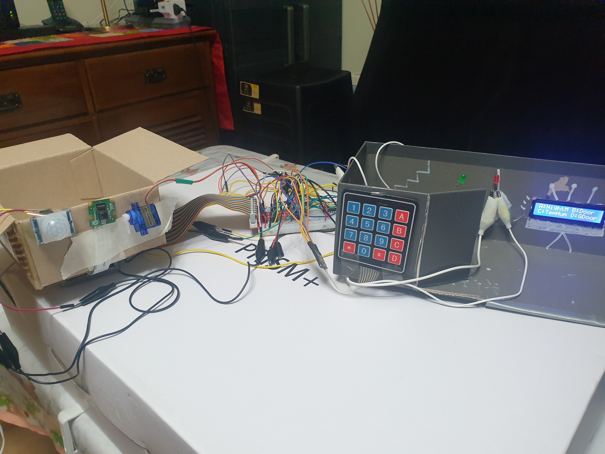  

**Steps(Hardware):**  
1) Create the code for smarthome.py
2) Replicate the code from the code file in this github repository known as smarthome.py  

**Steps(web application):**  
1) Creation of server page using the code uploaded in github known as server.py  

Here is the image of how the **server** should be run using EC2:  
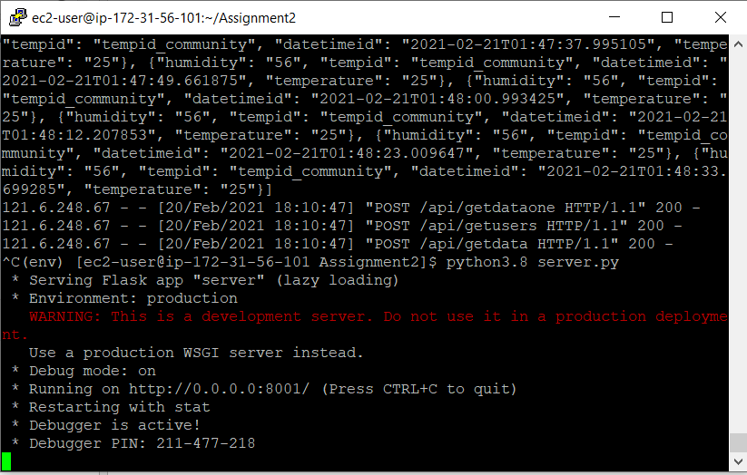  

2) Creation of login page using the code uploaded in github known as login.html

Here is the image of how the **login page** should look like after you use our code in github:  
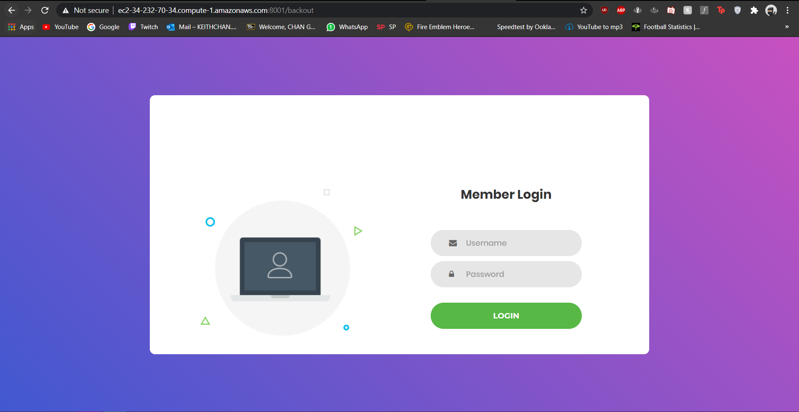  

3) Creation of index page using the code uploaded in github known as index.html  

Here is the image of how the **index** should look like after you use our code in github:  
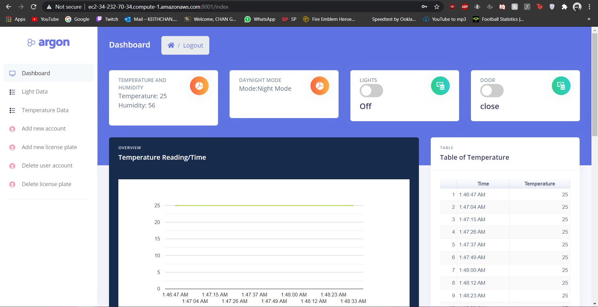  
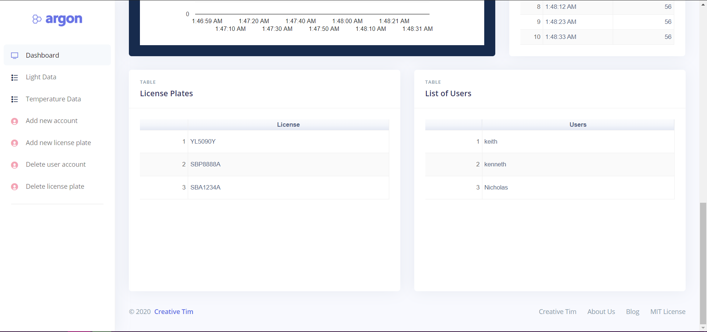  

4) Creation of light page using the code uploaded in github known as lights.html  

Here is how the **light page** should look like after you have use our code in github:  
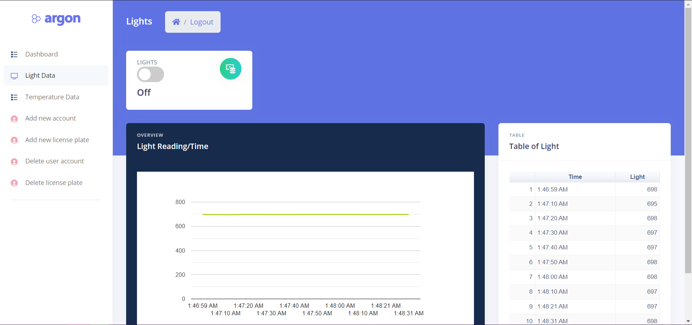  

5) Creation of temperature page using the code uploaded in github known as temperature.html  

Here is how the **temperature page** should look like after you have use our code in github:  
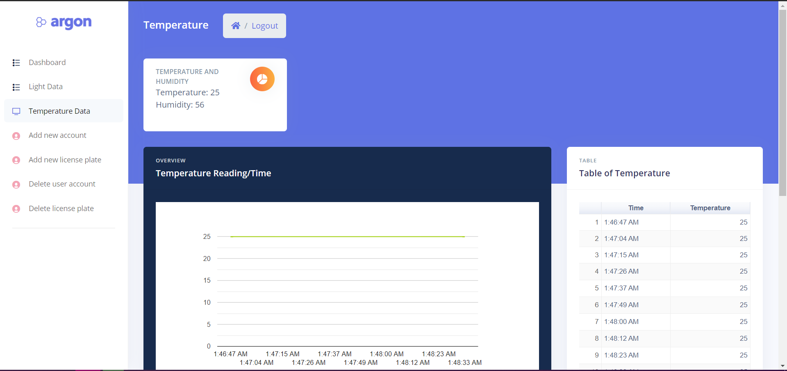  
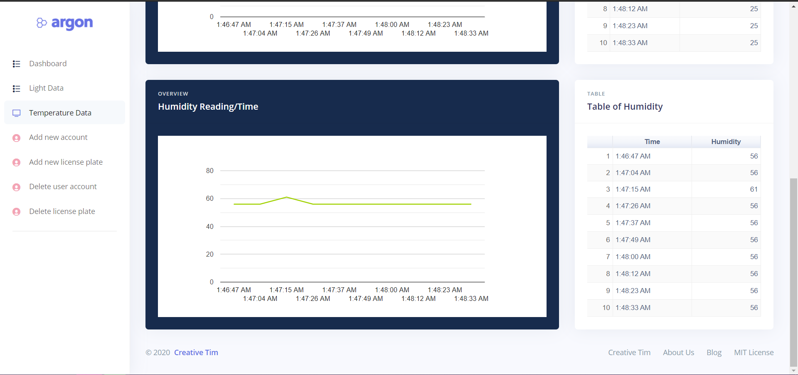

6) Creation of add user page using the code uploaded in github known as register.html  

Here is the image of how the **register page** should look like after you use our code in github:  
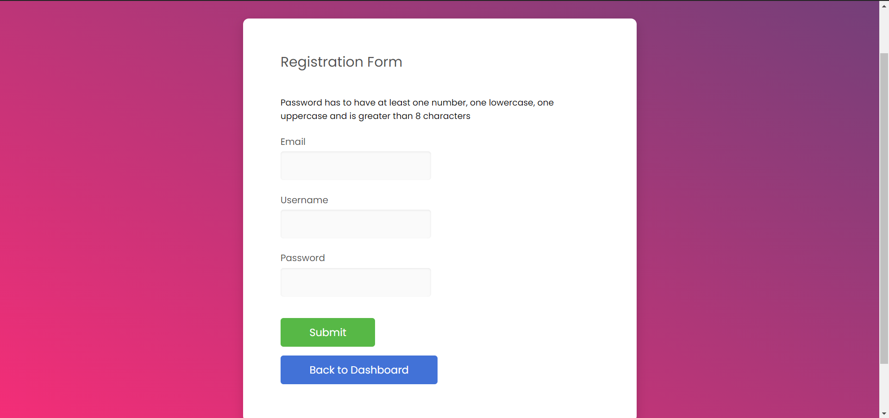

7) Creation of add license plate page using the code uploaded in github known as addlicense.html  

Here is the image of how the **addlicense page** should look like after you use our code in github:  
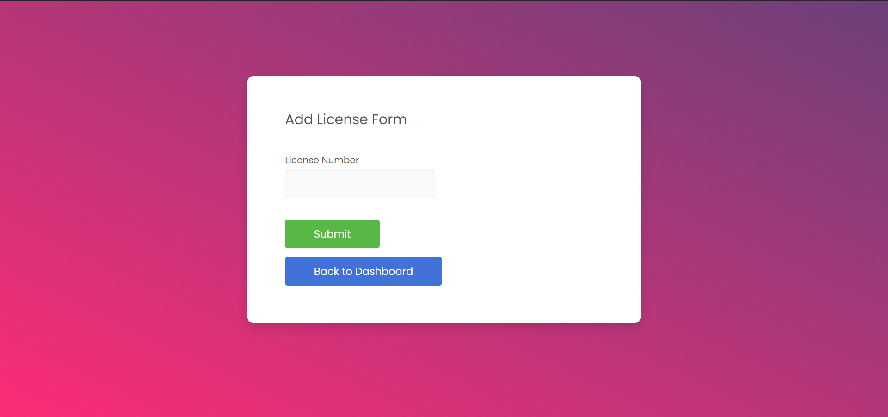

8) Creation of the delete user page using the code uploaded in github known as deleteuser.html  

Here is the image of how the **delete user page** should look like after you use our code in github:  
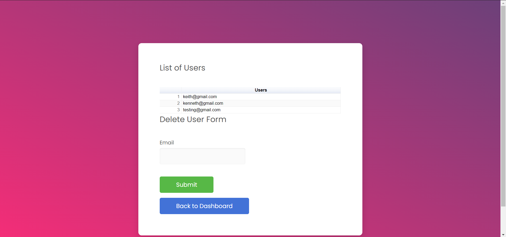

9) Creation of the delete license plate page using the code uploaded in github known as deletelicense.html  

Here is the image of how the **delete license plate** page should look like after you use our code in github:  
  

**Creation of AWS services:**  
1) DynamoDB
2) EC2
3) Amazon Rekognition
4) IOT core

**Create DynamoDB table:**
1) Head to AWS DynamoDB, and on the left navigation pane click on "Tables"
2) Click "Create table".
3) Fill in the fields accordingly:  
